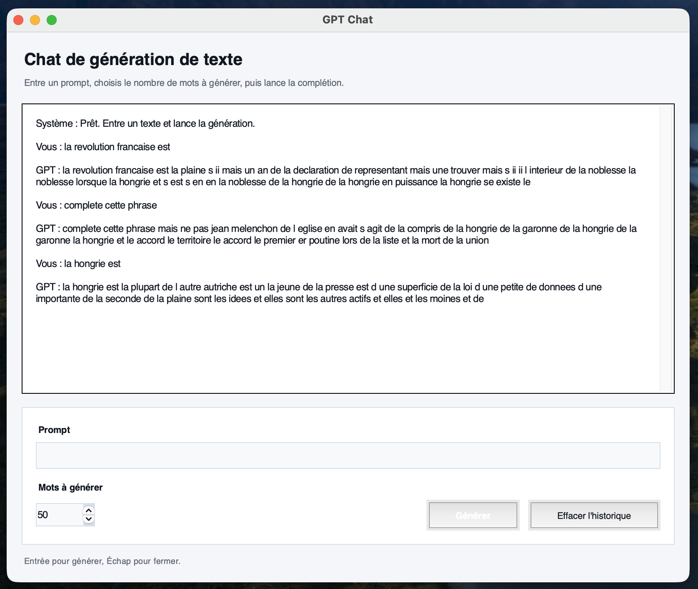

# Neural Network

## General

This program showcases a general *neural network* built **from scratch**, and exposes by default several scripts showing off *incredible performances* in **word prediction**, **number recognition** and **shape learning**.

This project is built *as a library*, which offers different objects that allow you to build **whatever AI system that you want**. To make your own **custom model**, you just have to specify which *layers* you want, you can choose **from a variety of layers and pre-architectured networks**.

To learn **how to use it** and create **your own AI tools**, just check out the default scripts *provided* in the `/scripts` directory.

---

It is important to remember that, even if your **models are saved as** *binary files*, ***they are readable and usable only by this project***.  
This project *is closer to* an **sandbox** to **learn and play with AI** than it is to a *production tool* and a *proper environment* to run AI at the greatest speed possible.

## About

I have **designed** and **coded** myself the *core algorithms* of **deep learning** you will find in this project. I have imagined the **main architecture** after *teaching myself* the basics of **machine learning** and deep learning.  
Therefore, **no code is AI generated** as it is part of a **learning process** *(except for the `/graphics` directory :)*

## Getting started

If you want to **launch this project**, follow these *steps*:

1. Clone this repo on your computer.
```
git clone https://github.com/AdlarX9/neural-network.git
```

2. Go to the root directory of the project.
```
cd neural-network
```

3. Install requirements.
```
pip install -r requirements.txt
```

4. Modify `/main.py` to make your own program, or use one in the `/scripts` directory.

5. Launch the project.
```
python main.py
```

# Examples

## Word prediction

### First steps

One of the default scripts provided by this project is *word prediction*. A *neural network* (**LSTM** or **GPT**) learns from a text to **predict** the word **that is the most likely to come after a given sentence**. For example, you will find in this project, a word prediction model that learns **only from these fifteen words**:
```
roi duc duchesse prince princesse bisous amour mariage lit dormir repos travail etat salaire argent
```
And after **a few minutes of training** of the *word embedding* and the *neural network*, it easily spits you out the **full sequence** from the three first words:
```
roi duc duchesse | prince princesse bisous amour mariage lit dormir repos travail etat salaire argent
```

### Going further

The next step is to **scale this up** to **hundreds of thousands of tokens**, and see the results after an hour of training :

> 
> *Our **GPT** (based on **LLaMA**'s architectures) can now complete sentences with almost no syntax errors*

## Shape learning

>   
> *Example of a model trained to reproduce the shape on the left square, we can clearly see the **model's approximation** on the right, which was learnt during its training*

>   
> *Same thing with a more **complex** shape*

## Number recognition

>   
> *The number **2***

>   
> *The number **6***

>   
> *The number **8***

>   
> *The number **3**, but it is not well drawn so the model hesitates with a 2*
